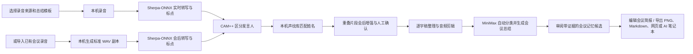

<p align="center">
  
</p>

<h1 align="center">拾音 AI｜听见讨论，看见下一步</h1>

<p align="center">把每一次讨论，沉淀为可回顾、可行动的会议知识。</p>

拾音 AI 是一款本地优先的中文会议听记与会议知识桌面应用。它使用 Sherpa-ONNX 在本机完成实时转写与中英文标点恢复，使用 CAM++ 在本机区分、校正并记忆发言人，再按需调用 MiniMax 自动判断会议类型，生成结构化纪要、可编辑会议简报和带原文证据的会议记忆候选。

本地转写不消耗云端语音时长。原始录音、逐字稿、发言人声纹、历史版本和会议列表默认保存在自己的电脑上；只有主动生成 AI 总结时，会议文本才会发送给 MiniMax。

> 当前开发基线：`0.6.12`<br>
> 使用阶段：个人使用与团队内部测试<br>
> 支持平台：Apple Silicon macOS、Windows x64<br>
> 授权状态：`UNLICENSED`，不是开源许可证；公开分发或商业使用前请先确认授权条件

[](https://github.com/jizw0704-source/shiyin-ai-meeting-notes/actions/workflows/macos-build.yml)
[](https://github.com/jizw0704-source/shiyin-ai-meeting-notes/actions/workflows/windows-build.yml)

## 0.6.12 版本亮点

- **会议记忆候选**：AI 总结后提取人物、单位、项目、决定、需求和术语等值得跨会议保留的信息。
- **先确认再沉淀**：候选内容不会自动生效，用户可以确认、编辑或删除；所有记忆都保留原会议和逐字稿证据。
- **工作区统一管理**：本机工作区展示待确认、已确认数量和候选预览，并提供独立的会议记忆管理页。
- **隐私与恢复**：会议记忆默认只保存在本机，并纳入完整数据备份与恢复。

## 为什么做拾音 AI

- **减少云端时长焦虑**：录音和转写在本机完成，不依赖钉钉、豆包等产品的免费转写额度。
- **会议数据自己掌控**：录音、逐字稿、声纹和备份均保存在本地工作区。
- **适合固定团队**：给发言人命名一次后，后续会议可保守地自动匹配常用成员。
- **会后整理更高效**：支持口语过滤、全局查找替换、历史版本和 MiniMax 结构化总结。
- **方便进入下一条工作流**：可导出 Markdown、网页报告，或选择连接自己的 Obsidian Vault。

## 核心能力

| 环节 | 能力 | 默认处理位置 |
| --- | --- | --- |
| 录音 | 麦克风、电脑声音、电脑声音与麦克风混合录制 | 本机 |
| 外部录音导入 | 解析 MP3、M4A、WAV、FLAC、OGG、MP4、MOV、MKV 与 WebM，不修改源文件 | 本机 |
| 实时转写 | Sherpa-ONNX Paraformer 中英文转写 | 本机 |
| 断句与标点 | CT-Transformer 标点恢复，模型缺失时使用保守规则 | 本机 |
| 发言人区分 | 自动检测人数并逐步扩展，默认设置 20 人安全上限；支持实时聚类与会后校正 | 本机 |
| 重叠发言增强 Beta | 自动标记疑似重叠片段；会后尝试双人分离、分别转写和声纹回配，低置信度时保留原记录 | 本机 |
| 姓名记忆 | 人工命名后建立本机声纹档案，会议中渐进匹配、候选确认与结束时轻量复核 | 本机 |
| 逐字稿整理 | 原始记录、整理稿、正序/倒序、口语过滤、查找替换与撤销 | 本机 |
| 音频整理 | 按时间与发言人另存音频剪辑，原始录音保持不变 | 本机 |
| AI 总结 | 会议概览、议题、决策、风险、行动项和发言人贡献 | MiniMax |
| 会议简报 | AI 自动判断会议类型，生成可编辑的一页式简报并导出完整 PNG | MiniMax / 本机编辑与导出 |
| 会议记忆 | 从总结中提取长期事实候选；确认、编辑、删除并回看原文证据 | MiniMax 提取 / 本机确认与保存 |
| 本机工作区 | 汇总会议数量、累计时长、会议记忆和会议资料，检索并打开历史会议 | 本机 |
| 导出与连接 | Markdown、网页报告、复制给 AI Agent、可选 Obsidian | 本机 / 用户选择 |
| 数据保护 | 异常恢复、转写历史版本、完整备份与校验 | 本机 |

## 工作流程



## 快速开始

### 1. 安装应用

正式安装包通过 GitHub Actions 构建，并在 [GitHub Releases](https://github.com/jizw0704-source/shiyin-ai-meeting-notes/releases/latest) 提供：

- macOS：Apple Silicon DMG / ZIP；
- Windows：x64 NSIS EXE。

当前安装包尚未使用商业代码签名。macOS 可能触发 Gatekeeper，Windows SmartScreen 可能显示“未知发布者”。请只从本仓库的正式 Release 下载，并在安装前核对版本与 SHA-256 校验信息。

### 2. 配置 MiniMax（可选）

打开“设置 → AI 与纪要”，填写自己的 API Key 和模型名称。密钥由 Electron 的系统安全存储保存在当前电脑，不会写入安装包、会议备份或 Git 仓库。

不配置 MiniMax 时，录音、本地转写、标点、发言人识别和逐字稿整理仍可正常使用；之后补充密钥，可以对历史会议重新生成总结。

### 3. 开始会议

1. 选择录音来源：现场会议使用麦克风，线上会议使用电脑声音，混合会议可同时录制两者。
2. 默认使用自动检测人数；如需控制识别规模，可在设置中选择 6、12 或 20 人安全上限。
3. 选择总结模板和报告样式。
4. 首页查看精简的准备状态；完整“会议前自检”位于“设置 → 会议与转写”。绿色表示正常，黄色表示可以开始但需要留意，红色问题需要先处理。
5. 点击“开始会议”。按钮点击后会再次检查，避免使用已经失效的设备或权限。
6. 会议中查看实时逐字稿，必要时修正发言人姓名。
7. 结束后若发现疑似双人重叠片段，会先在本机尝试拆解并通过声纹校验，再生成 MiniMax 正式总结。
8. 对未通过校验的片段回听并人工确认；也可以按发言人和时间另存音频剪辑。
9. AI 会自动判断调研访谈、项目推进、方案评审等会议类型；可编辑一页式会议简报并导出完整 PNG，也可导出 Markdown、网页报告或连接自己的 AI 笔记本。

会议前自检会检查当前录音来源、macOS / Windows 权限、本地服务、转写模型、标点模型、声纹模型、磁盘空间和任务占用。MiniMax 属于可选总结能力，未配置时只会提示，不影响本地录音与转写。

点击窗口顶部或左侧栏的“拾音”标识，可以从设置页或其他记录快速返回本次会议；正在录音时不会因此停止或新建会议。开始前选择“清爽、专注、声场、夜间”背景会立即预览，窗口顶部、侧边栏、工作区和主要卡片会用轻量色调同步进入对应氛围，并在录音过程中保持一致；浅色、深色或跟随系统仍由独立的界面外观设置控制。

历史会议位于左侧栏；会议较多时可上下滚动，会议名称支持重命名和搜索。点击左侧底部“本机工作区”，可以集中查看会议数量、累计时长、会议记忆、会议资料和完整历史档案。会议记忆必须经过确认，且始终可以回看原会议和逐字稿证据；后续基于会议内容的问答会建立在这些可追溯内容之上。

### 4. 导入其他会议录音

在空白会议页点击“导入已有会议录音”，或把文件直接拖到该入口，选择来自钉钉、腾讯会议、Teams、Zoom 或其他工具的音频/视频文件。拾音会在本机生成用于分析的 16 kHz 单声道 WAV 副本，然后自动完成转写、发言人识别、重叠发言增强和可选的 MiniMax 总结；所选源文件不会被修改。导入过程中可以在会议页查看处理阶段和进度，异常退出后已生成的录音与逐字稿仍会被保留。

## 平台说明

### macOS

- 主要验收平台为 Apple Silicon Mac。
- 麦克风录音需要系统权限；如果尚未授权，点击首页的权限按钮会直接打开 macOS 麦克风隐私设置，返回应用后会自动重新检测。
- 电脑声音需要“屏幕与系统音频录制”权限，并要求 macOS 15 或更高版本。
- 选择系统音频时，应用只读取声音，不保存或上传共享画面。
- 混合录音建议佩戴耳机，避免扬声器声音被麦克风重复录入。

### Windows

- 支持 Windows x64 NSIS 安装包。
- 桌面版可直接选择麦克风或系统播放声音。
- 麦克风被系统阻止时，点击开始会议会直接打开 Windows 麦克风隐私设置。
- GitHub Actions 会在 Windows runner 上完成模型加载、安装、启动、覆盖升级、卸载和数据保留测试。
- 仍建议团队成员在真实设备上验证麦克风、会议软件声音和长会议稳定性。

### 全局快捷键

| 快捷键 | 功能 |
| --- | --- |
| macOS：`Control + Option + M` / Windows：`Ctrl + Alt + M` | 打开或唤回应用 |
| macOS：`Control + Option + R` / Windows：`Ctrl + Alt + R` | 开始或结束听记 |

关闭窗口会隐藏应用；完全退出后，全局快捷键不再响应。

## 发言人记忆

1. 在第一次会议中，把“发言人 1”等名称改为真实姓名。
2. 应用将姓名与该发言人的 CAM++ 声纹向量关联，并保存在本机声纹库。
3. 下次会议先显示普通发言人编号；累计至少 3 段、约 6 秒清晰语音后，应用会在会议进行中持续尝试匹配。
4. 高置信度时自动填入姓名并标记为“声纹匹配”；中等置信度时显示“可能是某人”，由用户一键确认。
5. 会议结束时会使用已经积累的声纹做一次轻量复核，并与 AI 总结并行衔接，不重新读取整段录音。
6. 如果匹配错误，可以直接修改姓名继续校准。

自动匹配同时检查最低相似度、候选差距和有效样本数量；过短片段与疑似重叠发言不会污染声纹档案。证据不足时保留普通发言人编号，不强行猜测。该功能仅用于会议整理，不能用于身份认证。

## 逐字稿与 AI 总结

### 逐字稿整理

- 原始记录与整理稿分开保存；
- 正序适合会后阅读，倒序适合会议中查看最新内容；
- 可过滤“嗯、啊”等口语填充词；
- 可查找并全局替换简称、术语或识别错误；
- 整理操作支持撤销，不覆盖原始 ASR 文本；
- 重新转写会生成历史版本，可恢复旧版本。
- 会后双人拆解成功时会标记“会后拆解”；处理前逐字稿自动保存为可恢复版本。

### MiniMax 总结

会议结束后可生成结构化纪要，包括会议概览、核心议题、关键事实、决策、风险和行动项。总结失败不会删除录音或逐字稿，配置好密钥后可对历史会议重新生成。

### 可选 AI 笔记本

Obsidian 是可选连接，不是必需依赖：

- 默认不连接、不自动同步；
- 可在“设置 → 笔记与导出”中选择自己的 Obsidian Vault；
- 可单次同步，也可自行开启会议结束后自动同步；
- 未连接时不会弹出目录选择或产生同步错误。

## 数据、备份与升级

### 数据位置

| 环境 | 默认位置 |
| --- | --- |
| macOS 安装版 | `~/Library/Application Support/拾音 AI/` |
| Windows 安装版 | `%APPDATA%\拾音 AI\` |
| 源码开发模式 | 项目目录下的 `data/` |

每场会议的 WAV 录音位于 `data/meetings/<会议ID>/audio.wav`；会议、逐字稿、总结、声纹和版本信息保存在本地 SQLite 数据库。

### 完整备份

左侧“本机存储”可以创建完整备份，包括录音、逐字稿、人工修改、AI 总结、会议记忆、发言人、声纹库和转写历史。备份使用文件大小和 SHA-256 校验完整性；恢复时只合并缺失会议，不覆盖已有会议。MiniMax API Key 不会进入备份。

### 安装新版

会议数据与 App 本体分开存放。覆盖安装新版或删除应用程序本体，不会主动删除个人数据目录中的旧会议。重要升级前仍建议先创建完整备份。

## 从源码运行

### 环境要求

- Node.js `22.13.0` 或更高版本；
- npm，并使用仓库中已提交的 `package-lock.json`；
- MiniMax API Key 仅在需要 AI 总结时使用；
- 本地 ASR 和标点模型体积较大，开发者需按下文路径准备；声纹与双人分离模型随应用资源提供。
- 源码模式导入非标准 WAV 时，需要通过 `SHIYIN_FFMPEG_PATH` 指向本机 FFmpeg；macOS / Windows 发布流程会准备经过授权和校验的 LGPL 转换器。

### 安装依赖

```bash
npm ci
```

### 准备本地模型

从 [Sherpa-ONNX 官方 ASR 模型发布页](https://github.com/k2-fsa/sherpa-onnx/releases/tag/asr-models)准备 Paraformer 模型，并将文件放到以下位置：

```text
models/
├── asr/
│   ├── encoder.int8.onnx
│   ├── decoder.int8.onnx
│   └── tokens.txt
├── punctuation/
│   └── model.int8.onnx
├── speaker/
│   └── 3dspeaker_speech_campplus_sv_zh-cn_16k-common.onnx
└── separation/
    └── convtasnet_16k.onnx
```

ASR 使用 `sherpa-onnx-streaming-paraformer-bilingual-zh-en`；标点使用 Sherpa-ONNX CT-Transformer zh-en int8 模型。CAM++ 发言人模型与 Conv-TasNet 双人分离模型已包含在仓库中；分离模型的来源、校验值、授权和局限见 `models/separation/README.md`。标点模型缺失时会回退到保守断句规则，不影响录音和转写。

### 配置环境

```bash
cp .env.example .env.local
```

常用配置：

```dotenv
MINIMAX_API_KEY=your_minimax_api_key
MINIMAX_MODEL=MiniMax-M3

SHIYIN_ASR_MODE=local
SHIYIN_LOCAL_ASR_MODEL_DIR=./models/asr
SHIYIN_PUNCTUATION_MODEL_PATH=./models/punctuation/model.int8.onnx
SHIYIN_LOCAL_ASR_SILENCE_MS=1200
SHIYIN_MODEL_PATH=./models/speaker/3dspeaker_speech_campplus_sv_zh-cn_16k-common.onnx
SHIYIN_SEPARATION_MODEL_PATH=./models/separation/convtasnet_16k.onnx
SHIYIN_DATA_ROOT=./data
```

请勿提交 `.env.local`、API Key 或个人配置。默认 `SHIYIN_ASR_MODE=local` 不需要百炼或 `DASHSCOPE_API_KEY`；只有主动切换到 DashScope 云端转写时才需要相应密钥。

### 启动

```bash
# Electron 桌面开发模式
npm run desktop:dev

# 网页界面与本地后台
npm run dev
```

默认网页地址为 `http://127.0.0.1:3000`。普通浏览器模式只支持麦克风录音，电脑声音录制需要桌面版。

## 开发与验证

| 命令 | 用途 |
| --- | --- |
| `npm run lint` | ESLint 检查 |
| `npm run typecheck` | TypeScript 类型检查 |
| `npm test` | 生产构建与自动化测试 |
| `npm run test:native-models` | 加载当前平台的 ASR、标点、声纹和双人分离模型 |
| `npm run build` | 生成生产构建 |
| `npm run desktop:dist:mac` | 构建 Apple Silicon DMG 与 ZIP |
| `npm run desktop:dist:win` | 构建 Windows x64 NSIS 安装包 |

提交功能前至少运行：

```bash
npm run lint
npm run typecheck
npm test
npm run test:native-models
```

## 双平台构建与发布

- [macOS build and smoke test](https://github.com/jizw0704-source/shiyin-ai-meeting-notes/actions/workflows/macos-build.yml)：模型校验、DMG/ZIP 构建、安装版启动、覆盖升级、移除应用和数据保留验证。
- [Windows build and smoke test](https://github.com/jizw0704-source/shiyin-ai-meeting-notes/actions/workflows/windows-build.yml)：模型校验、EXE 构建、安装、启动、覆盖升级、卸载和数据保留验证。
- `Create internal draft release`：要求手动输入 `CREATE_DRAFT`，重新验证两端后创建未公开的 Draft + Prerelease，不会自动公开发布。

## 应用内更新

桌面安装版会在窗口顶部和设置页展示当前版本号，并在“设置 → 更新与快捷键”中提供当前版本简介与完整版本记录。应用启动约 12 秒后检查新版本，并在持续运行时每 4 小时检查一次；左侧底部的“版本更新”也可以随时手动检查。发现更新后，应用会展示 GitHub Release 中的更新说明，再由用户确认下载；下载完成后，由用户点击“重启并更新”，会议进行中不会安装更新。

完整变化可查看 [版本记录](CHANGELOG.md)。开发新版本时需要同步更新 `package.json`、`package-lock.json`、`public/version-history.json` 和 `CHANGELOG.md`；公开 Release 的正文应使用相同的简要说明。

更新来源是本仓库的 GitHub Releases。只有正式公开、版本号更高且带有对应更新元数据的 Release 才会被用户端发现；Draft Release 和 Prerelease 不会进入默认稳定更新通道。发布时必须同时保留安装包、`latest.yml` / `latest-mac.yml` 和对应的 `.blockmap` 文件。

当前自动更新功能处于内部测试阶段。macOS 正式自动更新前必须使用稳定的 Developer ID 完成签名与公证；Windows 面向用户发布前也应完成代码签名。更新只替换应用程序，会议记录、录音、声纹库、MiniMax 配置和 Obsidian 设置仍保存在原有本机数据目录中。

真实设备验收请参考：

- [macOS 版本验收清单](docs/MACOS_TEST_CHECKLIST.md)
- [Windows 版本验收清单](docs/WINDOWS_TEST_CHECKLIST.md)
- [双平台版本发布流程](docs/RELEASE_PROCESS.md)

## 主要代码结构

```text
app/page.tsx                  桌面主界面与会议交互
app/globals.css               响应式布局与跨平台视觉适配
desktop/main.mjs              Electron 窗口、权限、托盘与快捷键
server/realtime-proxy.mjs     本地 API、WebSocket 与任务调度
server/local-asr-engine.mjs   Sherpa-ONNX 实时转写与标点
server/speaker-engine.mjs     实时声纹提取与发言人分配
server/correction.mjs         会后发言人校正与姓名匹配
server/overlap-enhancement.mjs 双人重叠片段分离、转写与声纹回配
server/audio-editing.mjs      无损原录音的时间与发言人音频剪辑
server/meeting-preflight.mjs  会议前权限、模型、存储与服务检查
server/meeting-title.mjs      内外部会议判断与自适应命名
server/summarizer.mjs         MiniMax 纪要、会议分类与会议简报
server/storage.mjs            SQLite、声纹库与历史版本
server/workspace-backup.mjs   完整备份、校验与恢复
tests/                        持久化、接口和界面构建测试
```

## 数据与隐私边界

| 数据 | 默认去向 |
| --- | --- |
| 原始录音 | 只保存在本机 |
| 原始及整理后的逐字稿 | 保存在本机 |
| CAM++ 声纹向量与姓名映射 | 只保存在本机 |
| MiniMax API Key | 使用系统安全存储保存在当前电脑 |
| 生成总结所需的会议文本 | 仅在触发 MiniMax 总结时发送 |
| Obsidian 笔记 | 仅写入用户主动选择的 Vault |
| 共享屏幕画面 | 不保存、不上传 |

语音转写、标点恢复、声纹识别和跨会议姓名匹配不依赖 MiniMax。人工替换、口语过滤和排列切换使用独立整理或显示层，不覆盖原始识别文本。

## 当前限制

- 双人重叠拆解属于 Beta：清晰、短时的两人重叠更容易成功；三人以上、远场、强混响或噪声环境仍会保留“待确认”，重要内容应回听确认。
- 过短片段可能继承相邻发言人；人数越多、音色越接近，聚类和姓名匹配越容易产生歧义。
- Paraformer 不提供逐词时间戳，句段时间由实时音频位置估算。
- 本地标点能改善可读性，但专业名词、简称和复杂语气仍建议会后检查。
- MiniMax 总结需要网络连接、有效密钥和可用额度。
- 本机工作区目前提供统计、会议档案、资料与可追溯会议记忆；跨会议语义检索与问答尚未开放。
- macOS 与 Windows 安装包目前均未进行商业代码签名。

## 来源与授权

本项目基于 [LightningFlashEvE/shiyin-ai-meeting-notes](https://github.com/LightningFlashEvE/shiyin-ai-meeting-notes) 持续改造。

仓库虽然公开可见，但 `package.json` 标记为 `private`，项目许可证为 `UNLICENSED`。这不等同于允许复制、分发或商业使用；向团队外公开发布前，应确认原作者、模型文件和第三方依赖的授权条件。
