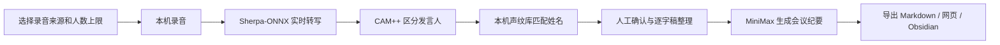

# 拾音 AI｜本地优先的会议听记

拾音 AI 是一款面向中文会议的桌面听记应用。它使用 Sherpa-ONNX Paraformer 在本机完成实时转写，使用 CAM++ 在本机区分和记忆发言人，再按需调用 MiniMax 生成结构化会议纪要。

本地模式不消耗云端语音转写时长额度。原始录音、逐字稿、发言人声纹档案和历史版本均保存在自己的电脑上；只有在生成 AI 总结时，整理后的会议文本才会发送给 MiniMax。

> 当前源码版本：`0.5.1`<br>
> 主要验收平台：Apple Silicon Mac；Windows x64 已补充自动构建与安装冒烟测试<br>
> 项目状态：个人使用与内部测试；当前仓库为 `UNLICENSED`，对外分发或商业使用前需确认授权。

## 快速导航

- [核心能力](#核心能力)
- [0.5 系列重点功能](#05-系列重点功能)
- [在 Mac 上安装和使用](#在-mac-上安装和使用)
- [数据、备份与更新](#数据备份与更新)
- [从源码运行](#从源码运行)
- [开发命令](#开发命令)
- [数据与隐私边界](#数据与隐私边界)
- [当前限制](#当前限制)

## 为什么做这个应用

- **本地转写**：减少对钉钉、豆包等云端听记时长额度的依赖。
- **数据可控**：录音、原始逐字稿和声纹档案留在本机。
- **适合固定团队**：人工命名一次后，后续会议可以自动匹配常用发言人。
- **便于继续加工**：支持 Markdown、网页报告和 Obsidian，可交给其他 AI Agent 深入分析。
- **可持续迭代**：安装新版不会主动删除旧会议，历史转写也可保留多个版本。

## 工作流程



## 核心能力

| 环节 | 能力 | 处理位置 |
| --- | --- | --- |
| 录音 | 麦克风、电脑声音、电脑声音与麦克风混合录制 | 本机 |
| 转写 | 中英文实时转写、句段时间、停顿提示 | 本机 |
| 发言人 | 6、12、20 人上限，实时聚类与会后校正 | 本机 |
| 姓名记忆 | 手动命名后建立常用发言人声纹档案，后续会议保守匹配 | 本机 |
| 逐字稿 | 整理稿/原始记录、正序/倒序、口语过滤、查找替换与撤销 | 本机 |
| AI 总结 | 实时草稿、正式纪要、决策、风险、行动项和发言人贡献 | MiniMax |
| 导出 | Markdown、网页报告、复制给 AI Agent、Obsidian 同步 | 本机 |
| 数据保护 | 异常恢复、历史转写版本、完整备份与校验 | 本机 |

## 0.5 系列重点功能

### 正序与倒序记录

逐字稿工具栏可切换：

- **正序**：最早的记录在上方，适合会后完整阅读。
- **倒序**：最新记录在上方，适合会议进行中持续查看。

排列方式只影响显示，不会改写数据库中的原始时间顺序；应用会在本机记住上次选择。

### 跨会议自动匹配发言人

1. 在第一次会议中点击“发言人 1”等姓名并改为真实姓名。
2. 应用将姓名与该发言人的 CAM++ 声纹向量关联，保存在本机声纹库。
3. 下次会议检测到相似声音时，应用自动填入姓名并显示“声纹匹配”。
4. 如果匹配错误，直接修改姓名即可继续校准。

自动匹配同时检查最低相似度和候选差距。相似度不足，或两位候选过于接近时，应用会保留普通发言人编号，不强行猜测姓名。该功能用于提高会议整理效率，不可用于身份认证。

## 在 Mac 上安装和使用

### 使用安装包

当前主要支持 Apple Silicon Mac：

1. 打开 `拾音 AI-0.5.0-arm64.dmg`。
2. 将“拾音 AI”拖入“应用程序”。
3. 首次启动若被 macOS 拦截，请在 Finder 中右键应用并选择“打开”。
4. 打开应用左下角的“MiniMax 设置”，填写自己的 API Key。

安装包未使用 Apple Developer ID 签名，适合个人使用和内部测试。MiniMax Key 不包含在安装包中，由 macOS 加密后保存在个人应用数据目录。

### 开始一场会议

1. 选择录音来源：现场会议用麦克风，线上会议用电脑声音，混合会议可同时录制两者。
2. 根据会议规模选择 6、12 或 20 人上限。
3. 选择总结模板和报告样式。
4. 点击中央“开始会议”。
5. 会议中可使用倒序查看最新记录，也可随时修正发言人姓名。
6. 结束后等待本地发言人校正和 MiniMax 正式总结。
7. 将结果导出为 Markdown、网页报告或同步到 Obsidian。

### Mac 权限

- 使用麦克风时，需要允许“系统设置 → 隐私与安全性 → 麦克风”。
- 使用电脑声音时，需要允许“屏幕与系统音频录制”。
- macOS 15 或更高版本会显示原生共享选择器；请选择会议所在屏幕并开启系统音频。
- 应用只读取共享来源中的声音，不保存或上传共享画面。
- 混合录音建议佩戴耳机，避免扬声器声音再次被麦克风录入。

### 全局快捷键

| 快捷键 | 功能 |
| --- | --- |
| `Control + Option + M` | 打开或唤回拾音 AI |
| `Control + Option + R` | 开始或结束听记 |

关闭窗口只会隐藏应用，托盘后台仍可继续录音和处理任务；完全退出应用后，全局快捷键不再响应。

## 数据、备份与更新

### 数据位置

- macOS 安装版：`~/Library/Application Support/拾音 AI/`
- Windows 安装版：`%APPDATA%\拾音 AI\`
- 源码开发模式：默认使用项目下的 `data/`

每场会议的 WAV 录音位于 `data/meetings/<会议ID>/audio.wav`，会议、逐字稿、总结、声纹和版本信息保存在本地 SQLite 中。

### 完整备份

在左侧“本机存储”中可以创建完整备份。备份包含：

- 原始录音；
- 逐字稿和人工修改；
- AI 总结；
- 发言人与本机声纹库；
- 历史转写版本。

备份文件使用文件大小与 SHA-256 进行完整性校验。恢复时只合并缺失会议，不覆盖当前已有会议；MiniMax API Key 不会进入备份。

### 安装新版

会议数据和 MiniMax 配置与 App 本体分开保存在个人应用数据目录。用新版覆盖“应用程序”中的旧版本不会主动删除旧会议。重要升级前仍建议先在“本机存储”中创建完整备份。

### 可选连接 AI 笔记本

Obsidian 同步默认关闭，不影响录音、转写或 MiniMax 总结。需要时可在左侧底部“MiniMax 设置”中连接自己的 Obsidian Vault，再选择是否在会议结束后自动同步；未连接时应用不会主动弹出 Obsidian 目录选择或同步错误。

## 从源码运行

### 环境要求

- Node.js `22.13.0` 或更高版本；
- npm，使用仓库中已提交的 `package-lock.json`；
- Apple Silicon Mac 为主要日常使用平台；Windows x64 通过 GitHub Actions 构建和安装验证；
- MiniMax API Key 仅在需要 AI 总结时使用。

### 1. 安装依赖

```bash
npm ci
```

### 2. 准备本地转写模型

从 [Sherpa-ONNX 官方发布页](https://github.com/k2-fsa/sherpa-onnx/releases/tag/asr-models) 下载 `sherpa-onnx-streaming-paraformer-bilingual-zh-en.tar.bz2`，将以下文件放入 `models/asr/`：

```text
models/
├── asr/
│   ├── encoder.int8.onnx
│   ├── decoder.int8.onnx
│   └── tokens.txt
├── punctuation/
│   └── model.int8.onnx
└── speaker/
    └── 3dspeaker_speech_campplus_sv_zh-cn_16k-common.onnx
```

CAM++ 发言人模型已包含在当前仓库中；Paraformer ASR 模型体积较大，需要单独准备。
中英文本地标点使用 Sherpa-ONNX 的 CT-Transformer int8 模型；模型缺失时会回退到保守断句规则，不影响录音与转写。

### 3. 配置环境

```bash
cp .env.example .env.local
```

常用配置：

```dotenv
MINIMAX_API_KEY=your_minimax_api_key
MINIMAX_MODEL=MiniMax-M2.7
SHIYIN_ASR_MODE=local
SHIYIN_LOCAL_ASR_MODEL_DIR=./models/asr
SHIYIN_PUNCTUATION_MODEL_PATH=./models/punctuation/model.int8.onnx
# 对话停顿约 1.2 秒后结束当前句；调小会更快断句，也更容易产生短句
SHIYIN_LOCAL_ASR_SILENCE_MS=1200
SHIYIN_MODEL_PATH=./models/speaker/3dspeaker_speech_campplus_sv_zh-cn_16k-common.onnx
SHIYIN_DATA_ROOT=./data
```

请勿提交 `.env.local`、API Key 或其他个人配置。若不配置 MiniMax，录音、本地转写和发言人识别仍可使用，之后可补充密钥再生成总结。

默认的 `SHIYIN_ASR_MODE=local` 不需要百炼或 `DASHSCOPE_API_KEY`；只有主动切换到 DashScope 云端转写模式时才需要相应密钥。

### 4. 启动

桌面开发模式：

```bash
npm run desktop:dev
```

仅启动网页界面和本地后台：

```bash
npm run dev
```

默认网页地址为 `http://127.0.0.1:3000`。普通浏览器模式只支持麦克风录音，电脑声音录制需要桌面版。

## 开发命令

| 命令 | 用途 |
| --- | --- |
| `npm ci` | 按锁文件安装依赖 |
| `npm run desktop:dev` | 启动 Electron 桌面开发模式 |
| `npm run dev` | 启动网页界面与本地后台 |
| `npm run lint` | 运行 ESLint |
| `npm run typecheck` | 运行 TypeScript 类型检查 |
| `npm test` | 构建并运行全部自动化测试 |
| `npm run test:native-models` | 实际加载并调用当前平台的本地转写与声纹模型 |
| `npm run build` | 生成生产构建 |
| `npm run desktop:start` | 运行已构建的桌面应用 |
| `npm run desktop:pack` | 生成未压缩的桌面应用目录 |
| `npm run desktop:dist` | 生成当前平台安装包 |
| `npm run desktop:dist:mac` | 在 Apple Silicon Mac 上生成 arm64 DMG 与 ZIP |
| `npm run desktop:dist:win` | 在 Windows 上生成 x64 NSIS 安装包 |

提交功能前至少运行：

```bash
npm run lint
npm run typecheck
npm test
```

## 打包说明

### macOS

```bash
npm run desktop:dist:mac
```

Apple Silicon DMG 与 ZIP 会生成到 `release/`。推送到 `main` 后，`macOS build and smoke test` 会在 ARM64 Mac runner 上完成模型推理、DMG 挂载、安装版启动、覆盖安装和移除应用后的数据保留测试。

### Windows

Windows x64 使用 NSIS 安装包。推送到 `main` 后，[Windows build and smoke test](https://github.com/jizw0704-source/shiyin-ai-meeting-notes/actions/workflows/windows-build.yml) 会在真实 Windows runner 上完成：

- 校验并加载固定版本的 Paraformer 与 CAM++ 模型；
- 运行 lint、类型检查和全部自动化测试；
- 构建并静默安装 Windows 安装包；
- 启动安装版，验证界面、本地后台、转写模型和发言人模型；
- 覆盖安装一次，并确认用户数据在升级和卸载后仍保留；
- 上传安装包、SHA-256 校验文件与测试结果，保留 30 天。

团队测试请只下载绿色 `Success` 运行中的 artifact，并按 [macOS 版本验收清单](docs/MACOS_TEST_CHECKLIST.md) 或 [Windows 版本验收清单](docs/WINDOWS_TEST_CHECKLIST.md) 验证真实麦克风、电脑声音、快捷键和长会议。安装包目前未使用商业代码签名；macOS 可能触发 Gatekeeper，Windows SmartScreen 可能显示“未知发布者”。

### 双平台内部版本

需要整理一个可供内部测试的版本时，可以手动运行 `Create internal draft release`。流程会重新构建并验证 Mac 与 Windows，然后创建未公开的 Draft + Prerelease；不会自动发布给用户。操作步骤与正式发布前检查见 [双平台版本发布流程](docs/RELEASE_PROCESS.md)。

## 主要代码结构

```text
app/page.tsx                 桌面主界面与会议交互
app/globals.css              响应式与 Mac 视觉适配
desktop/main.mjs             Electron 窗口、权限、托盘与快捷键
server/realtime-proxy.mjs    本地 API、WebSocket 与任务调度
server/local-asr-engine.mjs  Sherpa-ONNX 实时转写
server/speaker-engine.mjs    实时声纹提取与发言人分配
server/correction.mjs        会后发言人重新聚类与姓名匹配
server/storage.mjs           SQLite、声纹库与历史版本
server/workspace-backup.mjs  完整备份、校验与恢复
tests/                       本地持久化和界面构建测试
```

## 数据与隐私边界

| 数据 | 默认去向 |
| --- | --- |
| 原始录音 | 只保存在本机 |
| 原始及整理后的逐字稿 | 保存在本机 |
| CAM++ 声纹向量与姓名映射 | 只保存在本机 |
| MiniMax API Key | 桌面版使用系统安全存储；开发版使用本机环境文件 |
| 生成总结所需的会议文本 | 仅在触发 MiniMax 总结时发送 |
| 共享屏幕画面 | 不保存、不上传 |

语音转写、声纹识别和跨会议姓名匹配不依赖 MiniMax。人工替换、口语过滤和排列切换使用独立整理或显示层，不覆盖原始识别文本。

## 当前限制

- 两人同时说话时，当前模型无法稳定拆分重叠语音。
- 短于约 1.2 秒的片段可能继承相邻发言人。
- 发言人数越多、音色越接近，自动区分和姓名匹配越容易出现歧义。
- 声纹匹配是整理辅助能力，不是身份认证或安全验证功能。
- 当前 Paraformer 模型不提供逐词时间戳，句段时间由实时音频位置估算。
- MiniMax 总结需要网络连接和有效额度；失败时应用会尽量保留已有实时草稿。
- 当前 macOS 与 Windows 安装包均未进行商业代码签名。

## 来源与授权

本项目基于 [LightningFlashEvE/shiyin-ai-meeting-notes](https://github.com/LightningFlashEvE/shiyin-ai-meeting-notes) 持续改造。当前仓库在 `package.json` 中标记为 `private` 且使用 `UNLICENSED`，这不等同于开源许可证；向团队外分发、公开发布或商业使用前，应先确认原作者、模型与第三方依赖的授权条件。
