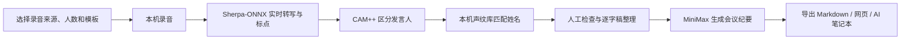

# 拾音 AI｜本地优先的中文会议听记

拾音 AI 是一款面向中文会议的 macOS / Windows 桌面应用：使用 Sherpa-ONNX 在本机完成实时转写与中英文标点恢复，使用 CAM++ 在本机区分、校正并记忆发言人，再按需调用 MiniMax 生成结构化会议纪要。

本地转写不消耗云端语音时长。原始录音、逐字稿、发言人声纹、历史版本和会议列表默认保存在自己的电脑上；只有主动生成 AI 总结时，会议文本才会发送给 MiniMax。

> 当前版本：`0.5.4`<br>
> 使用阶段：个人使用与团队内部测试<br>
> 支持平台：Apple Silicon macOS、Windows x64<br>
> 授权状态：`UNLICENSED`，不是开源许可证；公开分发或商业使用前请先确认授权条件

[](https://github.com/jizw0704-source/shiyin-ai-meeting-notes/actions/workflows/macos-build.yml)
[](https://github.com/jizw0704-source/shiyin-ai-meeting-notes/actions/workflows/windows-build.yml)

## 为什么做拾音 AI

- **减少云端时长焦虑**：录音和转写在本机完成，不依赖钉钉、豆包等产品的免费转写额度。
- **会议数据自己掌控**：录音、逐字稿、声纹和备份均保存在本地工作区。
- **适合固定团队**：给发言人命名一次后，后续会议可保守地自动匹配常用成员。
- **会后整理更高效**：支持口语过滤、全局查找替换、历史版本和 MiniMax 结构化总结。
- **方便进入下一条工作流**：可导出 Markdown、网页报告，或选择连接自己的 Obsidian Vault。

## 核心能力

| 环节 | 能力 | 默认处理位置 |
| --- | --- | --- |
| 录音 | 麦克风、电脑声音、电脑声音与麦克风混合录制 | 本机 |
| 实时转写 | Sherpa-ONNX Paraformer 中英文转写 | 本机 |
| 断句与标点 | CT-Transformer 标点恢复，模型缺失时使用保守规则 | 本机 |
| 发言人区分 | 6、12、20 人会议上限，实时聚类与会后校正 | 本机 |
| 姓名记忆 | 人工命名后建立本机声纹档案，跨会议保守匹配 | 本机 |
| 逐字稿整理 | 原始记录、整理稿、正序/倒序、口语过滤、查找替换与撤销 | 本机 |
| AI 总结 | 会议概览、议题、决策、风险、行动项和发言人贡献 | MiniMax |
| 导出与连接 | Markdown、网页报告、复制给 AI Agent、可选 Obsidian | 本机 / 用户选择 |
| 数据保护 | 异常恢复、转写历史版本、完整备份与校验 | 本机 |

## 工作流程



## 快速开始

### 1. 安装应用

内部测试安装包通过 GitHub Actions 构建：

- macOS：Apple Silicon DMG / ZIP；
- Windows：x64 NSIS EXE。

当前安装包尚未使用商业代码签名。macOS 可能触发 Gatekeeper，Windows SmartScreen 可能显示“未知发布者”。请只从本仓库成功的构建任务或维护者提供的内部 Draft Release 下载。

### 2. 配置 MiniMax（可选）

打开左侧底部的“MiniMax 设置”，填写自己的 API Key 和模型名称。密钥由 Electron 的系统安全存储保存在当前电脑，不会写入安装包、会议备份或 Git 仓库。

不配置 MiniMax 时，录音、本地转写、标点、发言人识别和逐字稿整理仍可正常使用；之后补充密钥，可以对历史会议重新生成总结。

### 3. 开始会议

1. 选择录音来源：现场会议使用麦克风，线上会议使用电脑声音，混合会议可同时录制两者。
2. 根据会议规模选择 6、12 或 20 人上限。
3. 选择总结模板和报告样式。
4. 点击“开始会议”。
5. 会议中查看实时逐字稿，必要时修正发言人姓名。
6. 结束后等待本地发言人校正，再由 MiniMax 生成正式总结。
7. 导出 Markdown、网页报告，或连接自己的 AI 笔记本。

历史会议位于左侧栏；会议较多时可上下滚动，会议名称支持重命名和搜索。

## 平台说明

### macOS

- 主要验收平台为 Apple Silicon Mac。
- 麦克风录音需要“系统设置 → 隐私与安全性 → 麦克风”权限。
- 电脑声音需要“屏幕与系统音频录制”权限，并要求 macOS 15 或更高版本。
- 选择系统音频时，应用只读取声音，不保存或上传共享画面。
- 混合录音建议佩戴耳机，避免扬声器声音被麦克风重复录入。

### Windows

- 支持 Windows x64 NSIS 安装包。
- 桌面版可直接选择麦克风或系统播放声音。
- GitHub Actions 会在 Windows runner 上完成模型加载、安装、启动、覆盖升级、卸载和数据保留测试。
- 仍建议团队成员在真实设备上验证麦克风、会议软件声音和长会议稳定性。

### 全局快捷键

| 快捷键 | 功能 |
| --- | --- |
| macOS：`Control + Option + M` / Windows：`Ctrl + Alt + M` | 打开或唤回应用 |
| macOS：`Control + Option + R` / Windows：`Ctrl + Alt + R` | 开始或结束听记 |

关闭窗口会隐藏应用；完全退出后，全局快捷键不再响应。

## 发言人记忆

1. 在第一次会议中，把“发言人 1”等名称改为真实姓名。
2. 应用将姓名与该发言人的 CAM++ 声纹向量关联，并保存在本机声纹库。
3. 下次会议检测到相似声音时，应用自动填入姓名并标记为“声纹匹配”。
4. 如果匹配错误，可以直接修改姓名继续校准。

自动匹配同时检查最低相似度和候选差距；证据不足时保留普通发言人编号，不强行猜测。该功能仅用于会议整理，不能用于身份认证。

## 逐字稿与 AI 总结

### 逐字稿整理

- 原始记录与整理稿分开保存；
- 正序适合会后阅读，倒序适合会议中查看最新内容；
- 可过滤“嗯、啊”等口语填充词；
- 可查找并全局替换简称、术语或识别错误；
- 整理操作支持撤销，不覆盖原始 ASR 文本；
- 重新转写会生成历史版本，可恢复旧版本。

### MiniMax 总结

会议结束后可生成结构化纪要，包括会议概览、核心议题、关键事实、决策、风险和行动项。总结失败不会删除录音或逐字稿，配置好密钥后可对历史会议重新生成。

### 可选 AI 笔记本

Obsidian 是可选连接，不是必需依赖：

- 默认不连接、不自动同步；
- 可在“MiniMax 设置”中选择自己的 Obsidian Vault；
- 可单次同步，也可自行开启会议结束后自动同步；
- 未连接时不会弹出目录选择或产生同步错误。

## 数据、备份与升级

### 数据位置

| 环境 | 默认位置 |
| --- | --- |
| macOS 安装版 | `~/Library/Application Support/拾音 AI/` |
| Windows 安装版 | `%APPDATA%\拾音 AI\` |
| 源码开发模式 | 项目目录下的 `data/` |

每场会议的 WAV 录音位于 `data/meetings/<会议ID>/audio.wav`；会议、逐字稿、总结、声纹和版本信息保存在本地 SQLite 数据库。

### 完整备份

左侧“本机存储”可以创建完整备份，包括录音、逐字稿、人工修改、AI 总结、发言人、声纹库和转写历史。备份使用文件大小和 SHA-256 校验完整性；恢复时只合并缺失会议，不覆盖已有会议。MiniMax API Key 不会进入备份。

### 安装新版

会议数据与 App 本体分开存放。覆盖安装新版或删除应用程序本体，不会主动删除个人数据目录中的旧会议。重要升级前仍建议先创建完整备份。

## 从源码运行

### 环境要求

- Node.js `22.13.0` 或更高版本；
- npm，并使用仓库中已提交的 `package-lock.json`；
- MiniMax API Key 仅在需要 AI 总结时使用；
- 本地 ASR 和标点模型体积较大，不提交到 Git 仓库。

### 安装依赖

```bash
npm ci
```

### 准备本地模型

从 [Sherpa-ONNX 官方 ASR 模型发布页](https://github.com/k2-fsa/sherpa-onnx/releases/tag/asr-models)准备 Paraformer 模型，并将文件放到以下位置：

```text
models/
├── asr/
│   ├── encoder.int8.onnx
│   ├── decoder.int8.onnx
│   └── tokens.txt
├── punctuation/
│   └── model.int8.onnx
└── speaker/
    └── 3dspeaker_speech_campplus_sv_zh-cn_16k-common.onnx
```

ASR 使用 `sherpa-onnx-streaming-paraformer-bilingual-zh-en`；标点使用 Sherpa-ONNX CT-Transformer zh-en int8 模型。CAM++ 发言人模型已包含在仓库中。标点模型缺失时会回退到保守断句规则，不影响录音和转写。

### 配置环境

```bash
cp .env.example .env.local
```

常用配置：

```dotenv
MINIMAX_API_KEY=your_minimax_api_key
MINIMAX_MODEL=MiniMax-M2.7

SHIYIN_ASR_MODE=local
SHIYIN_LOCAL_ASR_MODEL_DIR=./models/asr
SHIYIN_PUNCTUATION_MODEL_PATH=./models/punctuation/model.int8.onnx
SHIYIN_LOCAL_ASR_SILENCE_MS=1200
SHIYIN_MODEL_PATH=./models/speaker/3dspeaker_speech_campplus_sv_zh-cn_16k-common.onnx
SHIYIN_DATA_ROOT=./data
```

请勿提交 `.env.local`、API Key 或个人配置。默认 `SHIYIN_ASR_MODE=local` 不需要百炼或 `DASHSCOPE_API_KEY`；只有主动切换到 DashScope 云端转写时才需要相应密钥。

### 启动

```bash
# Electron 桌面开发模式
npm run desktop:dev

# 网页界面与本地后台
npm run dev
```

默认网页地址为 `http://127.0.0.1:3000`。普通浏览器模式只支持麦克风录音，电脑声音录制需要桌面版。

## 开发与验证

| 命令 | 用途 |
| --- | --- |
| `npm run lint` | ESLint 检查 |
| `npm run typecheck` | TypeScript 类型检查 |
| `npm test` | 生产构建与自动化测试 |
| `npm run test:native-models` | 加载当前平台的 ASR、标点和声纹模型 |
| `npm run build` | 生成生产构建 |
| `npm run desktop:dist:mac` | 构建 Apple Silicon DMG 与 ZIP |
| `npm run desktop:dist:win` | 构建 Windows x64 NSIS 安装包 |

提交功能前至少运行：

```bash
npm run lint
npm run typecheck
npm test
npm run test:native-models
```

## 双平台构建与发布

- [macOS build and smoke test](https://github.com/jizw0704-source/shiyin-ai-meeting-notes/actions/workflows/macos-build.yml)：模型校验、DMG/ZIP 构建、安装版启动、覆盖升级、移除应用和数据保留验证。
- [Windows build and smoke test](https://github.com/jizw0704-source/shiyin-ai-meeting-notes/actions/workflows/windows-build.yml)：模型校验、EXE 构建、安装、启动、覆盖升级、卸载和数据保留验证。
- `Create internal draft release`：要求手动输入 `CREATE_DRAFT`，重新验证两端后创建未公开的 Draft + Prerelease，不会自动公开发布。

真实设备验收请参考：

- [macOS 版本验收清单](docs/MACOS_TEST_CHECKLIST.md)
- [Windows 版本验收清单](docs/WINDOWS_TEST_CHECKLIST.md)
- [双平台版本发布流程](docs/RELEASE_PROCESS.md)

## 主要代码结构

```text
app/page.tsx                  桌面主界面与会议交互
app/globals.css               响应式布局与跨平台视觉适配
desktop/main.mjs              Electron 窗口、权限、托盘与快捷键
server/realtime-proxy.mjs     本地 API、WebSocket 与任务调度
server/local-asr-engine.mjs   Sherpa-ONNX 实时转写与标点
server/speaker-engine.mjs     实时声纹提取与发言人分配
server/correction.mjs         会后发言人校正与姓名匹配
server/storage.mjs            SQLite、声纹库与历史版本
server/workspace-backup.mjs   完整备份、校验与恢复
tests/                        持久化、接口和界面构建测试
```

## 数据与隐私边界

| 数据 | 默认去向 |
| --- | --- |
| 原始录音 | 只保存在本机 |
| 原始及整理后的逐字稿 | 保存在本机 |
| CAM++ 声纹向量与姓名映射 | 只保存在本机 |
| MiniMax API Key | 使用系统安全存储保存在当前电脑 |
| 生成总结所需的会议文本 | 仅在触发 MiniMax 总结时发送 |
| Obsidian 笔记 | 仅写入用户主动选择的 Vault |
| 共享屏幕画面 | 不保存、不上传 |

语音转写、标点恢复、声纹识别和跨会议姓名匹配不依赖 MiniMax。人工替换、口语过滤和排列切换使用独立整理或显示层，不覆盖原始识别文本。

## 当前限制

- 两人同时说话时，当前模型无法稳定拆分重叠语音。
- 过短片段可能继承相邻发言人；人数越多、音色越接近，聚类和姓名匹配越容易产生歧义。
- Paraformer 不提供逐词时间戳，句段时间由实时音频位置估算。
- 本地标点能改善可读性，但专业名词、简称和复杂语气仍建议会后检查。
- MiniMax 总结需要网络连接、有效密钥和可用额度。
- macOS 与 Windows 安装包目前均未进行商业代码签名。

## 来源与授权

本项目基于 [LightningFlashEvE/shiyin-ai-meeting-notes](https://github.com/LightningFlashEvE/shiyin-ai-meeting-notes) 持续改造。

仓库虽然公开可见，但 `package.json` 标记为 `private`，项目许可证为 `UNLICENSED`。这不等同于允许复制、分发或商业使用；向团队外公开发布前，应确认原作者、模型文件和第三方依赖的授权条件。
